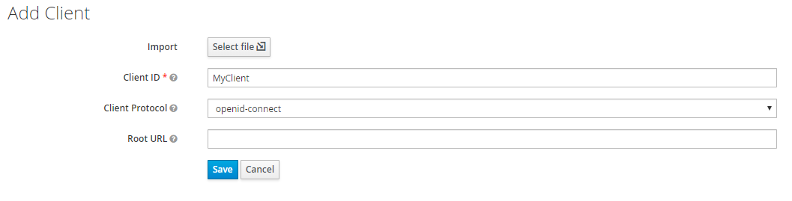
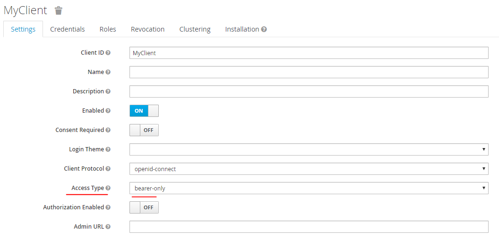
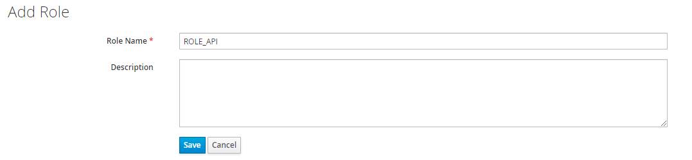

# Keycloak Configuration guide

### Create a realm

We assume that you already have a realm, if not you can create a realm from the Administration UI, go to ```Realm list > Add realm```


it will appear in the realm list after creation.

### Create a client

You must define a client that will configure the scope of your application security.
Make sure you already are in your newly created realm and create a new client by going in ```Configure > Clients > Create```.



Once created, you can configure it by going in ``` Configure > Clients > [Your client]```
Here is a sample configuration that work with our bundle :


> Note that the client Access type is bearer-only.

### Create roles
 
 In keycloak, roles are an abstraction of permissions for our application (used in security.yaml).
 In our case we need to define a role named **ROLE_API**
 
 You can configure it in ```Configure > Clients > [Your client] > Roles```
 
 
 
 ### Assign a role to a user

Last but not least we need to affect our role to our users.

To add role, go to ```Manage > Users > View all users > [Some User] > Role Mappings```.

* In the **Client Roles** dropdown, select your client that contains our role(s).
* Select Roles in **Available Roles** list, then click **Add selected** to assign role to the user.

And your all done, now you can use your client to secure your API.
